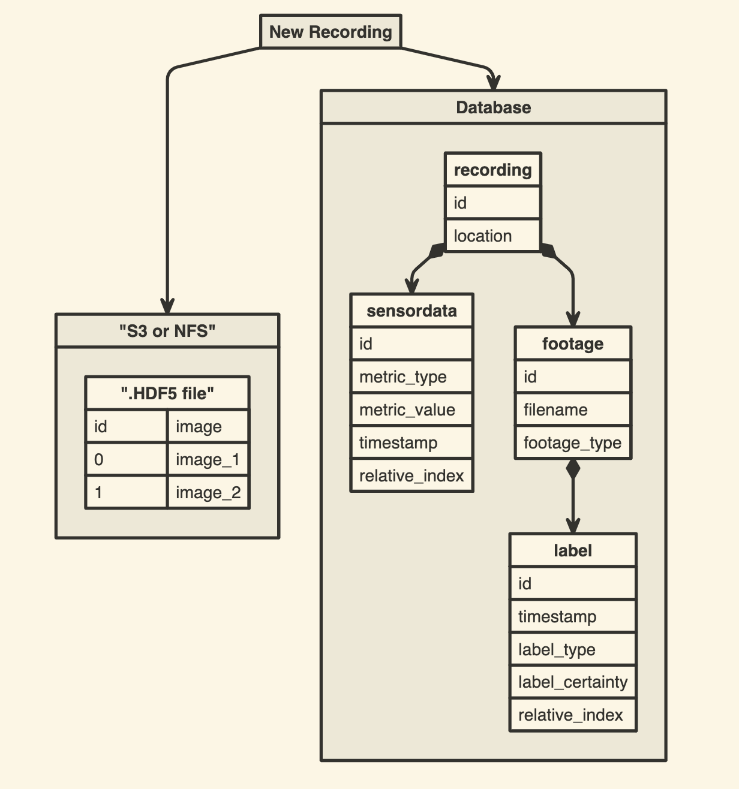
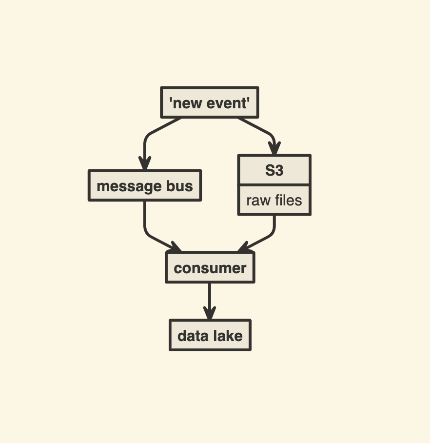

# Architecture

# Datalake architecture

## Condition 1: create any statistics from the sensor data

1. Store the metadata and the metrics in RDB:
 - Queries are easily done
 - Indexing helps query time
 - Most Data Science question are column based problems, not row based, that's why NoSql I'm not prefering

And databases can scale up

## Condition 2: Selected and find the images, using metrics
 
The options I came up with storing images:
 - store the images separately in the file storage, like S3 or maybe even NFS
 - store the images as a binary in the database

According to perfomance benchmarks, reading a binary blob data in Postgres is roughly 10 times slower. If the difference would be 2 times slower, I would consider the second option, but now I'll go with the first option.

### idea: store the images as hdf

Why hdf5?
Is a structured way to store files, - great flexibility in data structure, performant, small file size, availability of third party data access tools etc.

 - https://realpython.com/storing-images-in-python/
 

If the images are oredered, then selecting and reading a specific image is very fast

Sources:

 - https://www.cybertec-postgresql.com/en/binary-data-performance-in-postgresql/

### Schema explanation

A recording I defined as any car drive.
A recording can have any number of footages, depending how many cameras on the vehicle. 
Only footages can have labels, since an object is an image specific event.
And all sensor data are stored on a seperate table. All the object are connected with foreign keys.

### project structure

The db.ipynb contains the initialization of the system, and the example queries. I created the schema in SQLAlchemy, because defining objects in ORM is easier then writing down the Create queries by hand.

hdf5.ipynb cointains a small demo about how to save and read a .hdf5 file.

# Data Ingestion

Not part of the task, but some idea how the data will be ingested to the system.

First of all i would temporary all these big files in a s3 bucket.
Then send an event message to a message bus, and some consumers will ETL the data in to that system. This solution should be stateless, 
and scaleable.

kafka, rabbitmq message bus -> consumer api

Maybe other stacks have a better pre done solution, I'm not familiar with them. 

sources:
 - https://www.upsolver.com/blog/7-guidelines-ingesting-big-data-lakes
 - https://www.xenonstack.com/blog/big-data-ingestion

# After thougths

- Unfortunatly there is a limit, how much can a database query can perform. Sooner or later Spark or elasticsearch is should be used, and RDB SQL is not really optimized for this. I didn't not consider this at the begining, when I planned the system
- It's very inconvenient to group by a table, but keep the rows ( like select the max value)
- storing raw files can be corrupted unfortunetly
- if hdf5 are on the s3, then the file has to be downloaded before reading the specific image.